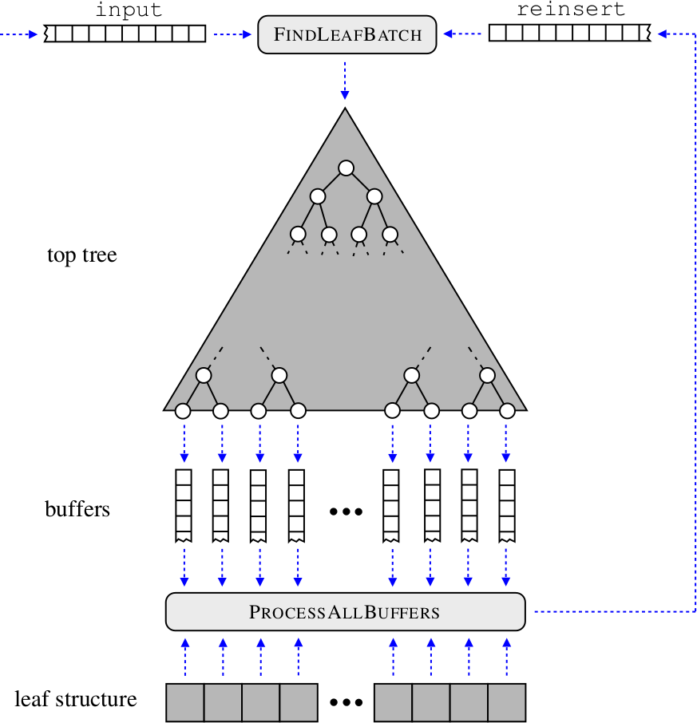

.. -*- rst -*-

Quick Overview
==============

The main approach provided by the bufferkdtree package is an efficient many-core implementation (suitable for, e.g., GPUs) for processing huge amounts of nearest neighor queries by means of so-called *buffer k-d trees*. Such trees depict modifications of standard k-d trees that can be used to make use of the massive parallelism provided by today's many-core devices (such as GPUs). 

Buffer k-d trees aim at scenarios, where you are given both a large reference (e.g., 1,000,000 points) and a huge query set (e.g., 10,000,000 points or more) with an input space of moderate dimensionality (e.g., from d=5 to d=25 dimensions). The general workflow is sketched below; the key idea is to "delay" the processing of nearest neighbor queries until enough work is gathered that can be processed by the many-core device.

**Workflow:** Initially, all queries are given in the input queue. The computation of nearest neighbors takes place in iterations. In each iteration, the procedure *FindLeafBatch* removes query indices from both queues and distributes them to the buffers (or removes them if no further processing is needed). In case enough work has been gathered, the procedure *ProcessAllBuffers* is invoked, which updates the nearest neighbors and reinserts all query indices into *reinsert*. The process stops as soon as both queues and all buffers are empty. For each query (index), an associated stack is stored, which is used to traverse the overall tree.

Note that each query is traversed in the same manner as for a standard k-d tree traversal (given the same tree depth). However, in contrast to the original traversal, queries are now grouped together before the nearest neighbors are updated in each leaf. This greatly improves the performance on today's many-core devices, since similar memory regions are processed by neighbored threads.

A detailed description of the techniques used and an experimental evaluation of the implementation using massive astronomical data sets are provided in:

Fabian Gieseke, Justin Heinermann, Cosmin Oancea, and Christian Igel. *Buffer k-d Trees: Processing Massive Nearest Neighbor Queries on GPUs*. In: Proceedings of the 31st International Conference on Machine Learning (ICML) 32(1), 2014, 172-180.  [`pdf <http://jmlr.org/proceedings/papers/v32/gieseke14.pdf>`_] [`bibtex <_static/bibtex/GiesekeHOI2014.bib>`_]

.. admonition:: Implicit Hardware Caches

   The brute-force step that takes place to empty the leaves via the many-core device makes use of implicit hardware caches. To achieve satisfying speed-ups, this feature has to be supported by the device (see, e.g., the `Kepler GK110 Whitepaper <http://www.nvidia.com/content/PDF/kepler/NVIDIA-Kepler-GK110-Architecture-Whitepaper.pdf>`_)

